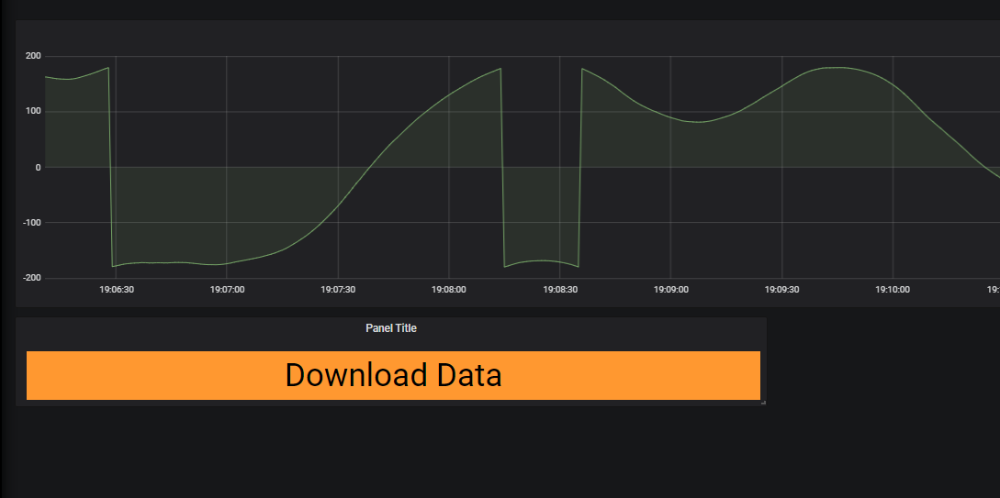



# Overview

This plugin is a Grana panel to download data from the openHistorian.
For this Panel to work the openHistorian Data Source plugin has to be installed and set-up and the openHistorian has to be installed.
Note that the Panel is just a different user interface to download data from the openhistorian. any user trying to download data still has to be authenticated by the openHistorian. 
If the Grafana included in the openHistorina installation is used this is already done automatically.

# Description

The panel consists of a single button. By clicking the Button the user can download a .csv file from the openHistorian, which will contain all data currently available to the Panel.
In order to match the data dowloaded to another panel (such as a graph) on the dashboard [Grafana Templating Variables](https://grafana.com/docs/grafana/latest/reference/templating/) should be used. 

## Settings

A full description of all available Settings can be found [here](./Settings.md) 

