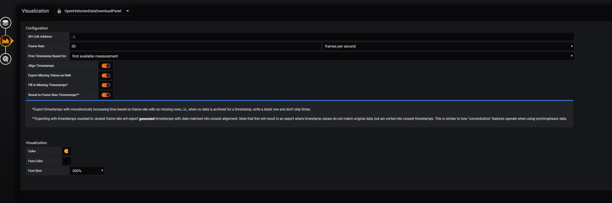



# Settings

### Data Download Settings
The following Settings are available in the Grafana plugin:
* **OH Link Adress**: This link is used to access the openHistorian.
For instance, if the openHistorian is running on a server `127.1.1.1` with the default port settings, then this link should be set to `http://127.1.1.1:8280/`
If the Grafana included in the openHistorian installation is used this can be set to `..\`

* **Frame Rate**: This is the framerate at which data is exported. For instance if this is set to `30 frames per second` then there csv file will contain 30 measurmetns per second.
* **First Timestamp based on**: This determines where the first Timestamp in the csv file should be.

* **Align Timestamps**: If this option is enabled the openHistorian will match Timestamps when exporting multiple data series.
* **Export missing Value as NaN**: If this option is enabled the csv file will contain NaN where values are missing.
* **Round to Framne Rate Timestamp**: If this option is enabled the Timestamps will be rounded to match the framerate defined. If it is disabled the csv file will contain the raw timestamp which could be different from those defined by the framerate.

### Visualization Settings

* **Color**: This determines the background color of the button.
* **Font Color**: This determines the color of the text on the button.
* **Font Size**: This determines tyhe size of the text.

